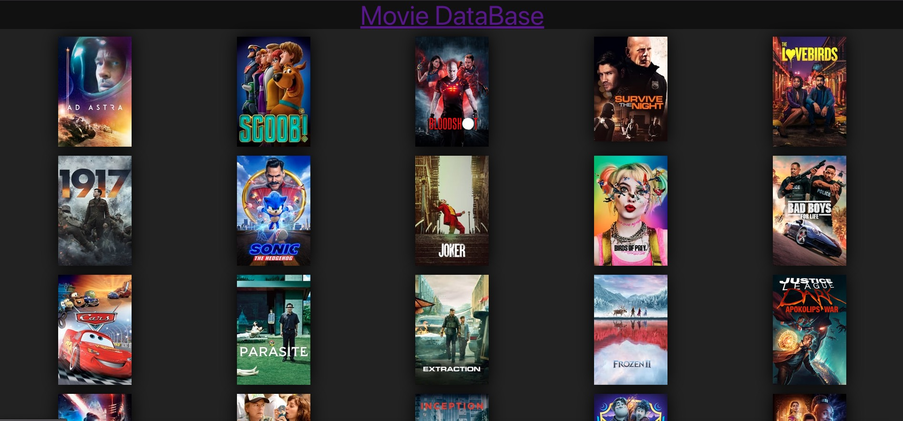
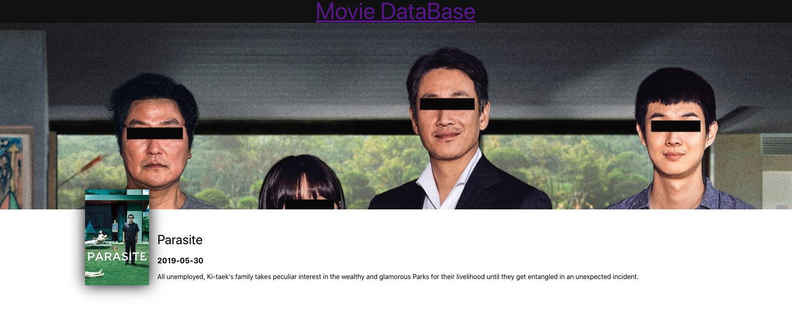

# movie-database-with-react
This is a Movie Database project that uses react.  
It uses a Movie API to fetch the movie titile, description, poster, release date and the header for each movie.  
This is my first project with react.   
This is the hompage of the Movie Database project.

 
This is a screenshot when you click on a movie.

